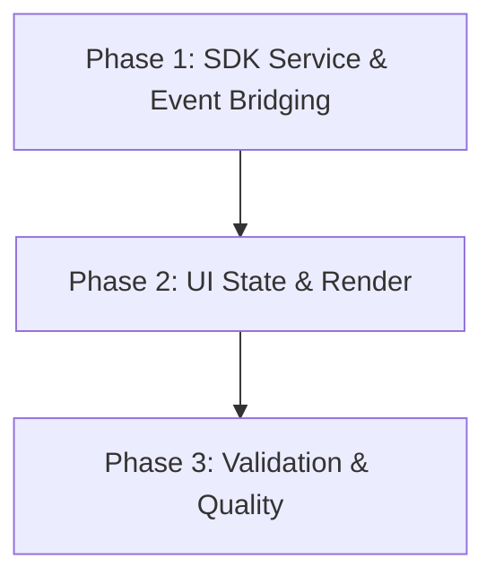

# Implementation Plan: Phase 2 - Room List

## 1. Plan Overview
- **Total Phases**: 3
- **Agents Involved**: `coder`, `code_reviewer`
- **Estimated Effort**: 1-2 hours
- **Objective**: Implement the sidebar Room List using `matrix_sdk_ui::RoomListService` and `libcosmic`'s `Nav` widget.

## 2. Dependency Graph

## 3. Execution Strategy Table
| Phase | Title | Agent | Execution Mode | Blocked By |
|-------|-------|-------|----------------|------------|
| 1 | SDK Service & Event Bridging | `coder` | sequential | None |
| 2 | UI State & Render | `coder` | sequential | 1 |
| 3 | Validation & Quality | `code_reviewer` | sequential | 2 |

## 4. Phase Details

### Phase 1: SDK Service & Event Bridging
- **Objective**: Initialize `RoomListService` within `MatrixEngine` and bridge its stream of `RoomListDiff` operations into the `libcosmic` update loop via `Message::Matrix`.
- **Agent**: `coder`
- **Files to Modify**:
  - `src/matrix/mod.rs`: Add `RoomListService` initialization. Define data structs for room metadata (e.g., `RoomData` containing id, name, last message). Expose a stream or channel for `RoomListDiff` events.
  - `src/main.rs`: Extend `Message::Matrix` to include diff variants (`RoomInserted(usize, RoomData)`, `RoomRemoved(usize)`, `RoomUpdated(usize, RoomData)`, `RoomListReset`).
- **Implementation Details**:
  - The `MatrixEngine` must wrap the `RoomListService` from `matrix-sdk-ui`.
  - Ensure the stream correctly maps SDK diffs into our application-specific messages.
- **Validation**: `cargo check`
- **Dependencies**: `blocked_by`: []

### Phase 2: UI State & Render
- **Objective**: Maintain a `Vec<RoomData>` in the `Claw` application state, apply diff operations in `update()`, and render the list in `view()` using `cosmic::widget::Nav`.
- **Agent**: `coder`
- **Files to Modify**:
  - `src/main.rs`: 
    - Update `Claw` struct to hold `room_list: Vec<RoomData>`.
    - Implement `update()` logic for diff messages (handling out-of-bounds carefully, especially on updates/removals).
    - Implement `view()` to render a `cosmic::widget::Nav` with `item` for each room.
- **Implementation Details**:
  - Handle the `RoomListReset` by clearing the vector (or requesting a fresh sync).
  - Use simple text elements in `Nav` items for now (room name).
- **Validation**: `cargo run` (Verify sidebar renders with room names).
- **Dependencies**: `blocked_by`: [1]

### Phase 3: Validation & Quality
- **Objective**: Perform a quality review of the bridging logic and UI state management to ensure no memory leaks, race conditions, or unhandled panics exist.
- **Agent**: `code_reviewer`
- **Files to Modify**: `src/main.rs`, `src/matrix/mod.rs` (Review only; any fixes will be delegated back to `coder`).
- **Implementation Details**:
  - Review the index-based vector mutations.
  - Ensure `matrix-sdk` internal store is not blocked by the UI.
- **Validation**: `cargo test` and manual code review.
- **Dependencies**: `blocked_by`: [2]

## 5. File Inventory
| File | Action | Phase | Purpose |
|------|--------|-------|---------|
| `src/matrix/mod.rs` | Modify | 1, 3 | Add `RoomListService` initialization and stream bridging. |
| `src/main.rs` | Modify | 1, 2, 3 | Extend messages, handle state diffs, render `Nav` widget. |

## 6. Risk Classification
- **Phase 1 (LOW)**: Standard SDK initialization.
- **Phase 2 (MEDIUM)**: Index-based vector mutations in `update()` could panic if out-of-sync with the SDK's internal state. Must handle `Reset` events correctly.
- **Phase 3 (LOW)**: Read-only review.

## 7. Execution Profile
Execution Profile:
- Total phases: 3
- Parallelizable phases: 0 (in 0 batches)
- Sequential-only phases: 3
- Estimated parallel wall time: N/A
- Estimated sequential wall time: ~10 minutes

Note: Native parallel execution currently runs agents in autonomous mode.
All tool calls are auto-approved without user confirmation.

## 8. Cost Estimation
| Phase | Agent | Model | Est. Input | Est. Output | Est. Cost |
|-------|-------|-------|-----------|------------|----------|
| 1 | coder | Pro | 2000 | 800 | $0.05 |
| 2 | coder | Pro | 2000 | 800 | $0.05 |
| 3 | code_reviewer | Pro | 4000 | 500 | $0.06 |
| **Total** | | | **8000** | **2100** | **$0.16** |