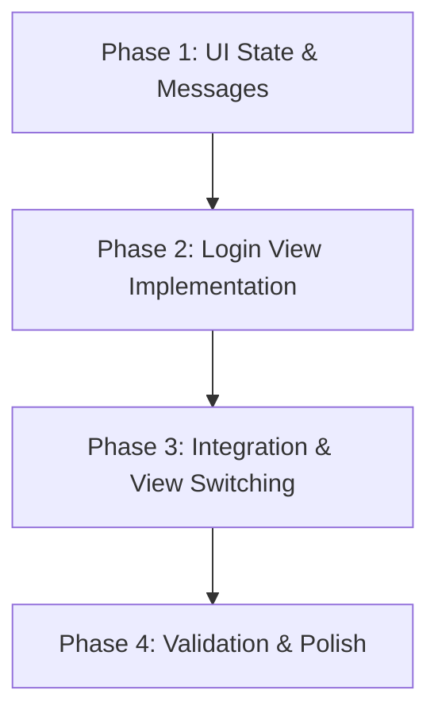

# Implementation Plan: Login Flow

The goal of this plan is to implement a dedicated login screen for the Claw Matrix client. Currently, the application attempts to restore a session on startup but remains in a "Disconnected" state if no session exists, with no UI to enter credentials.

## Plan Overview
- **Total Phases**: 4
- **Agents Involved**: `coder`, `code_reviewer`
- **Estimated Effort**: Medium
- **Execution Mode**: Sequential (due to high UI/Logic interdependence)

## Dependency Graph

## Execution Strategy Table
| Stage | Phase | Agent | Execution Mode |
|-------|-------|-------|----------------|
| 1 | 1, 2, 3 | `coder` | Sequential |
| 2 | 4 | `code_reviewer` | Sequential |

## Phase Details

### Phase 1: UI State & Messages
- **Objective**: Prepare `src/main.rs` with the necessary state and message variants for the login flow.
- **Agent Assignment**: `coder`
- **Files to Modify**:
    - `src/main.rs`: 
        - Add `login_homeserver`, `login_username`, `login_password`, `is_logging_in` fields to `Claw` struct.
        - Add `LoginInputChanged`, `SubmitLogin`, `LoginFinished(Result<String, String>)` to `Message` enum.
- **Validation Criteria**:
    - `cargo check` passes.
    - All new variants are accounted for in the `update` function (initially as `Task::none()`).

### Phase 2: Login View Implementation
- **Objective**: Create the visual login form.
- **Agent Assignment**: `coder`
- **Files to Modify**:
    - `src/main.rs`: Implement `view_login(&self) -> Element<'_, Message>`.
- **Implementation Details**:
    - Use `cosmic::widget::text_input` for Homeserver, Username, and Password (password should use `password()` or equivalent if available in `cosmic`).
    - Include a "Login" button that triggers `Message::SubmitLogin`.
    - Handle loading state with `is_logging_in`.
    - Display error messages from `self.error`.
- **Validation Criteria**:
    - `cargo check` passes.

### Phase 3: Integration & View Switching
- **Objective**: Wire up the login logic and switch views based on authentication state.
- **Agent Assignment**: `coder`
- **Files to Modify**:
    - `src/main.rs`:
        - Update `view()` to check `self.user_id`. If `None`, show `view_login()`.
        - Update `update()` to handle `LoginInputChanged`, `SubmitLogin`, and `LoginFinished`.
        - `SubmitLogin` should call `matrix.login(...)` and return `LoginFinished`.
- **Implementation Details**:
    - Ensure `SubmitLogin` uses `Task::perform` to call the async `login` method.
    - `LoginFinished` should update `self.user_id` and `self.is_logging_in`.
- **Validation Criteria**:
    - `cargo build` succeeds.
    - Application starts up on the login screen if no session exists.

### Phase 4: Validation & Polish
- **Objective**: Final quality gate and cleanup.
- **Agent Assignment**: `code_reviewer`
- **Files to Modify**: None
- **Validation Criteria**:
    - Run `cargo test` to ensure no regressions in `src/matrix/tests.rs`.
    - Perform a manual check of the login flow if a test environment is available.
    - Verify that `oo7` persistence works by restarting the app after a successful login.

## File Inventory
| Phase | Action | Path | Purpose |
|-------|--------|------|---------|
| 1-3 | Modify | `src/main.rs` | Main application UI and logic updates |

## Risk Classification
- **Phase 1-3**: MEDIUM. UI/UX logic in Iced/COSMIC can be tricky with state management, but the architecture is straightforward.

## Execution Profile
- Total phases: 4
- Parallelizable phases: 0
- Sequential-only phases: 4
- Estimated sequential wall time: 15-20 minutes

| Phase | Agent | Model | Est. Input | Est. Output | Est. Cost |
|-------|-------|-------|-----------|------------|----------|
| 1 | `coder` | Pro | 5K | 1K | $0.09 |
| 2 | `coder` | Pro | 6K | 2K | $0.14 |
| 3 | `coder` | Pro | 7K | 2K | $0.15 |
| 4 | `code_reviewer` | Pro | 8K | 1K | $0.12 |
| **Total** | | | **26K** | **6K** | **$0.50** |
